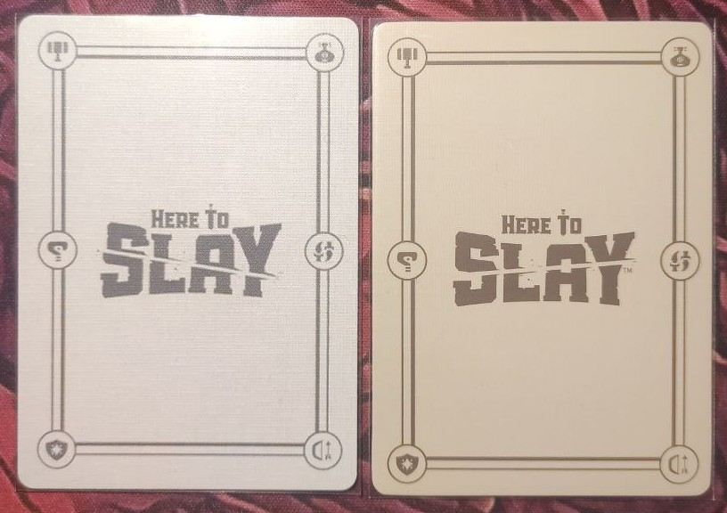
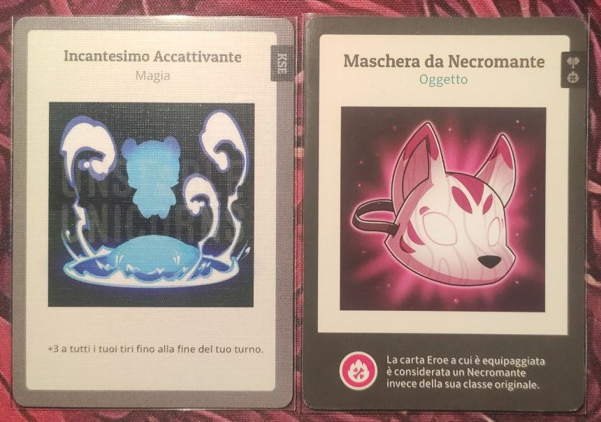
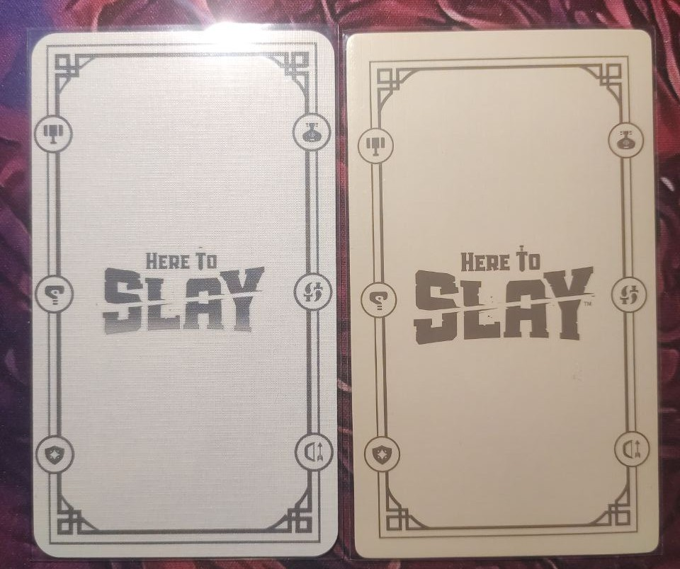
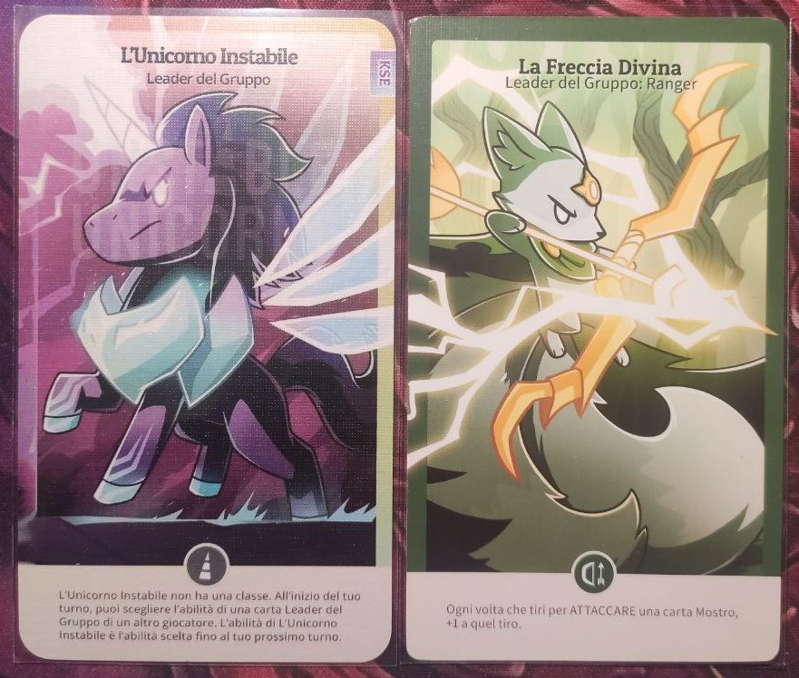
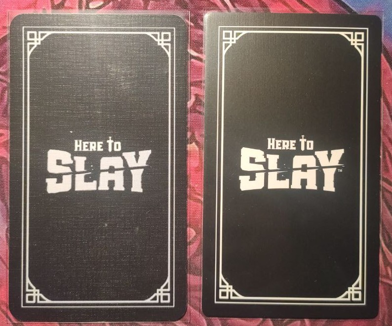
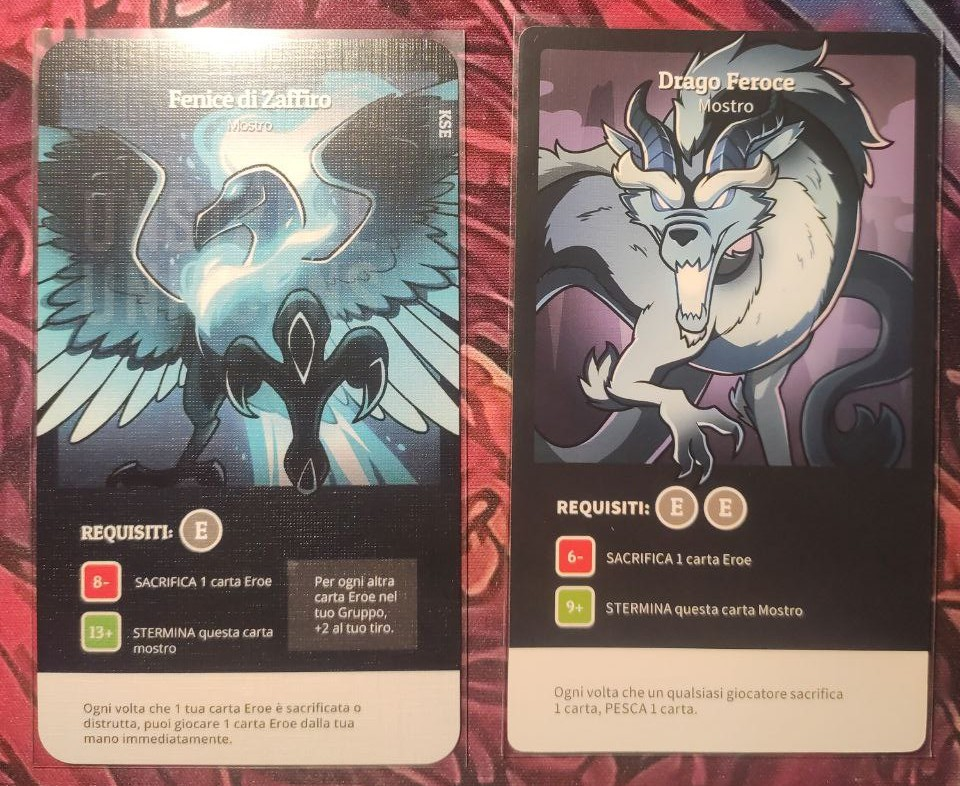

## Download 📥
Puoi [scaricare](https://github.com/i-decosmis/HTS_KSE_VE_CONV/archive/refs/heads/main.zip) il file zip o clonare la repository.
* Estrai la cartella dall'archivio zip scaricato.
* Le cartelle che contengono le immagini e il file PSD compresso sono `Poker Size` e `Tarot Size`.
* La cartella `Open Sans and Patua One` contiene dei font necessari per aprire il progetto PSD, tutto viene spiegato in basso.

## Video Tutorial 🎥
Ho caricato un video che spiega come tradurre una carta: [Video Tutorial](https://www.youtube.com/watch?v=HKW21eY4uks)

## Contenuto 🧐
* **File PNG** per ogni espansione (KSE, VE, CONV), suddivisi per lingua (Italiano e Inglese).
* **File PSD** per le carte in formato poker e tarocco, preparati con il template di Make Playing Cards (MPC).
* **Carte dei Mostri e dei Leader di Squadra modificabili**, senza nomi, in modo da poter aggiungere traduzioni usando i file PSD forniti.
* Una **traduzione completa in italiano** di tutte le carte.

## Organizzazione dei File 📌
I file sono organizzati in due cartelle principali:
* **Formato Poker**
* **Formato Tarocco**

Ogni cartella contiene sia i file PSD (compressed in a 7z archive) che PNG, organizzati per tipo di carta e includendo i retro delle carte.

### Organizzazione dei PNG 🖼️
Tutti i file PNG sono pronti per essere caricati sul sito [Make Playing Cards](https://www.makeplayingcards.com/), con i seguenti dettagli:
* [Formato Poker: 63 x 88mm](https://www.makeplayingcards.com/design/custom-blank-card.html)
* [Formato Tarocco](https://www.makeplayingcards.com/design/design-your-own-tarot-cards.html)

Le carte sono organizzate per categoria (es. `Sfide`), poi per lingua e per espansione. Ogni espansione include due versioni:
* **Con Etichetta**: Etichette personalizzate create per distinguere le carte per categoria, come ad esempio: 
  

* **Senza Etichetta**: Carte standard senza etichette personalizzate, per esempio: 
  

> Nota: Per la carta `L'Arciere Ritmico`, ho scelto di mantenere l'etichetta originale, quindi questa carta appare con l'etichetta in tutte le versioni.

## Dettagli dei File PSD 📸
**REQUISITI**:
* Installare i font presenti nella cartella `Open Sans and Patua One`. Nel caso di `Open Sans` consiglio di installare i due file ttf presenti nella cartella `Open_Sans` e ignorare la cartella `static`.

Estrai il file PSD con cui vuoi lavorare dall'archivio 7z e aprilo.

Nei file di Photoshop, ogni espansione è organizzata per categoria (es. `Challenges`) ed etichettata per espansione (es. `KSE`). Per ogni **cartella di ogni carta** nel file PSD, troverai i seguenti livelli:
* **Livello KSE/VE/CONV**: Un livello con l’etichetta creata per ogni espansione. (Per la carta `Sfida dello Stregone`, l’etichetta è stata leggermente abbassata per evitare di coprire il nome della carta).
* **Livello ITA**: L'immagine finale in italiano.
* **Cartella ITA**: Contiene i nomi e le descrizioni in italiano posizionati su ogni carta. **Puoi usare questo testo come base per tradurre in altre lingue**.
* **Livello Nascondi**: Nasconde il testo inglese sull'immagine di base della carta.
* **Livello Senza Nome (solo per Mostri e Leader di Squadra)**: Una versione della carta con il nome rimosso.
* **Livello Inglese**: La carta base in inglese.

## Risultati 📊

**Impostazioni che ho utilizzato per stampare le carte sul sito MakePlayingCards:**
- **Tipo di Carta:** M29 (come indicato in [questo post](#)).
- **Tipo di Stampa:** Stampa a Colori Completa.
- **Finitura:** Finitura carte MPC (come indicato in [questo post](#)).
- **Altre opzioni:** a tua preferenza.

Ho appena ricevuto le carte che ho ordinato dal sito MakePlayingCards, e ho incluso alcune foto qui sotto.

Rispetto all’originale, gli angoli delle carte mostrano un raggio di curvatura più grande, rendendo gli angoli meno netti e più arrotondati.

Ecco alcune cose che considererei di modificare:
- Invece di utilizzare M29, penso che una finitura M30 o M31 offrirebbe una texture più simile alle carte originali.
- Aggiornerò il mio template per il retro della carta del Party Leader per regolare i margini.

I colori delle varie immagini sono vivaci e la qualità di stampa è precisa, quindi il risultato complessivo è piuttosto buono.

**Per la leggera differenza di colore sul retro**: se il tuo gruppo include giocatori particolarmente competitivi e qualcuno ha bisogno di pescare una carta da un altro giocatore, puoi impilare le carte una sopra l’altra e far scegliere chiedendo un numero. Questo impedisce a chiunque di sfruttare la differenza di colore per selezionare una carta specifica.

---

**Foto**:
- **Retro Poker**:

  

- **Fronte Poker**:

  

- **Retro Party Leader**:
  

- **Fronte Party Leader**:
  

- **Retro Mostro**:
  

- **Fronte Mostro**:
  

## FAQ ❓
**D: Perché hai spostato l’etichetta solo sulla carta `Sfida dello Stregone` e non su tutte le altre per renderle uniformi?**

R: Preferisco che l’etichetta rimanga alla stessa altezza precisa su tutte le carte, perché mi piace così. Su quasi tutte le carte, questa posizione funziona perfettamente senza coprire dettagli importanti. Tuttavia, sulla carta `Sfida dello Stregone`, l’etichetta coprirebbe parte del nome, quindi ho regolato leggermente l’altezza solo per questa carta, per assicurare che il nome rimanga visibile.

**D: Quale impostazioni usare per stampare le carte sul sito [Make Playing Cards](https://www.makeplayingcards.com/)?**

R: Ho utilizzato le seguenti impostazioni:  
- **Tipo di Carta:** M29 (da questo [post](https://www.reddit.com/r/HereToSlay/comments/w7u6fc/does_anyone_know_what_type_of_cardstock_the_cards/)).  
- **Tipo di Stampa:** Stampa a Colori Completa.  
- **Finitura:** Finitura carte MPC (da questo [post](https://www.reddit.com/r/mpcproxies/comments/rycpki/mpc_card_stock_options_a_review/)).  
- **Altre opzioni:** a tua preferenza.  

**Consiglio:**  
- Invece di utilizzare M29, penso che una finitura M30 o M31 offrirebbe una texture più simile alle carte originali.  